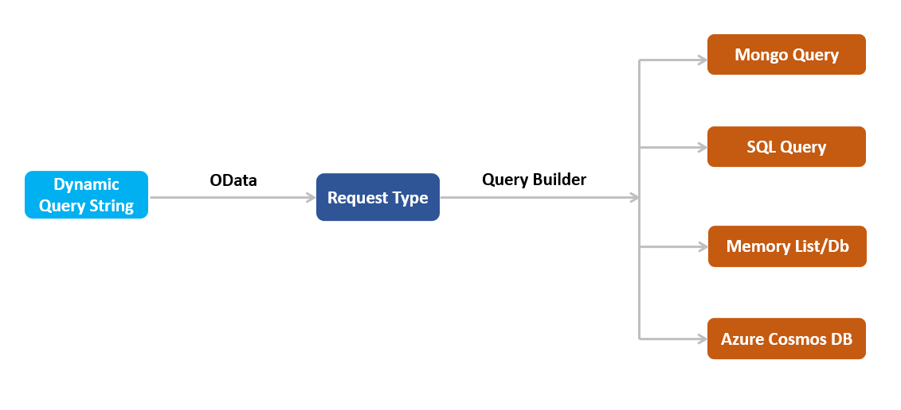

# DotnetStandardQueryBuilder

A Odata compliant Query Builder built using Dotnet Standard 2.0 for MongoDB, SQL, Azure Cosmos Db, In Memory database

[Project](https://nikhilsarvaiye.github.io/DotnetStandardQueryBuilder/)



## Features

1. Using [DotnetStandardQueryBuilder.Odata](https://www.nuget.org/packages/DotnetStandardQueryBuilder.Odata/) packages provides Odata compliant any Query String to Middleware Request object to further build query using available database query builders
3. Support for [DotnetStandardQueryBuilder.Mongo](https://www.nuget.org/packages/DotnetStandardQueryBuilder.Mongo/) for Mongo Database
3. Support for [DotnetStandardQueryBuilder.Sql](https://www.nuget.org/packages/DotnetStandardQueryBuilder.Sql/) for Sql Database
3. Support for [DotnetStandardQueryBuilder.AzureCosmosSql](https://www.nuget.org/packages/DotnetStandardQueryBuilder.AzureCosmosSql/) for Azure Cosmos database for Sql Query
4. Support for [DotnetStandardQueryBuilder.MemoryList](https://www.nuget.org/packages/DotnetStandardQueryBuilder.MemoryList/) for Memory List database

### How to use

1. Parsing Odata Query to Request Object

    ```csharp
    Install-Package DotnetStandardQueryBuilder.Core
    Install-Package DotnetStandardQueryBuilder.Odata
    ```
    ```csharp
    var request = new UriParser().Parse<T>('?$select=id&$filter=(id eq 545648 and name='DotnetStandardQueryBuilder')&top=10');
    ```

    Let's see how you can use it in web api

    ```csharp
    using DotnetStandardQueryBuilder.OData;
    [ApiController]
    [Route("[controller]")]
    public abstract class TestController<T> : ControllerBase
    {
        private readonly IService<T> _service;

        public TestController(IService<T> service)
        {
            _service = service;
        }

        [HttpGet]
        public async Task<dynamic> GetAsync()
        {
            var request = new UriParser().Parse<T>(Request.QueryString.ToString());

            if (request.Count)
            {
                return await _service.PaginateAsync(request);
            }

            return await _service.GetAsync(request);
        }
    }
    ```
    The [DotnetStandardQueryBuilder.Odata](https://www.nuget.org/packages/DotnetStandardQueryBuilder.Odata/) packages uses [Microsoft.OData.Core](https://www.nuget.org/packages/Microsoft.OData.Core/) package internally to decouple ODataUriParser logic and map [ODataUriParser](https://docs.microsoft.com/en-us/dotnet/api/microsoft.odata.uriparser.odatauriparser?view=odata-core-7.0) objects to [Request](https://github.com/nikhilsarvaiye/DotnetStandardQueryBuilder/blob/main/DotnetStandardQueryBuilder.Core/IRequest.cs).

2. Using [Request](https://github.com/nikhilsarvaiye/DotnetStandardQueryBuilder/blob/main/DotnetStandardQueryBuilder.Core/IRequest.cs) Object to build queries for Mongo,

    ```csharp
    var query = new MongoQueryBuilder<T>(request, _mongoCollection).Query();
    ```

    or you can simply use extension method

    ```csharp
    var query = _mongoCollection.Query(request);
    ```

    Example,

    ```csharp
    using MongoDB.Driver;
    using DotnetStandardQueryBuilder.Core;
    using System.Threading.Tasks;

    public class BaseRepository<T>
        where T : BaseModel
    {
        private readonly IMongoCollection<T> _mongoCollection;

        public BaseRepository(IDbOptions dbOptions, string collectionName)
        {
            var client = new MongoClient(dbOptions.ConnectionString);
            var database = client.GetDatabase(dbOptions.DatabaseName);

            _mongoCollection = database.GetCollection<T>(collectionName);
        }

        public async Task<List<T>> GetAsync(IRequest request = null)
        {
            var query = new MongoQueryBuilder<T>(request, _mongoCollection).Query();

            return await Task.FromResult(query.ToList());
        }
    }
    ```

3. Using [Request](https://github.com/nikhilsarvaiye/DotnetStandardQueryBuilder/blob/main/DotnetStandardQueryBuilder.Core/IRequest.cs) Object to build queries for Sql,

    ```csharp
    var tableName = "Users";
    var sqlQueryBuilder = new SqlQueryBuilder(request, tableName);
    
    var sqlQuery = sqlQueryBuilder.Query();
    
    var sqlCountQuery = sqlQueryBuilder.QueryCount();
    
    var sqlCreateQuery = sqlQueryBuilder.CreateQuery<T>(new List<T> { }, new List<string> { nameof(SampleModel.Id) });
    
    var sqlUpdateQuery = sqlQueryBuilder.UpdateQuery<T>(new List<T> { }, new List<string> { nameof(SampleModel.Id) });
    
    var sqlDeleteQuery = sqlQueryBuilder.DeleteQuery();
    ```

    or you can simply use SqlExpression class and extension methods

    ```csharp
    var tableName = "Users";
    var sqlExpression = new SqlExpression(request).Where().Select(tableName).OrderBy().Paginate();

    var sqlExpression = new SqlExpression(request).Where().Select(tableName).OrderBy();
    
    var sqlQuery = request.DeleteQuery(_tableName);
    ```

    The output Sql Query class provides output as expression and both values in seperate properties so you can pass them directly to avoid SqlInjection
    ```csharp 
    public class SqlQuery
    {
        public string Query { get; set; }

        public Dictionary<string, object> Values { get; set; }
    }
    ```

    4. In the same way, you can build queries for Azure Cosmos Data for Sql Query,

    ```csharp
    var azureCosmosSqlQueryBuilder = new AzureCosmosSqlQueryBuilder(request);
    var azureCosmosSqlQuery = azureCosmosSqlQueryBuilder.Query();
    var azureCosmosCountSqlQuery = azureCosmosSqlQueryBuilder.QueryCount();
    ```

4. You can directly use [Request](https://github.com/nikhilsarvaiye/DotnetStandardQueryBuilder/blob/main/DotnetStandardQueryBuilder.Core/IRequest.cs) object to even build queries from service to service without dependant on Odata query string

    ```csharp
    var request = new Request
    {
        Filter = new CompositeFilter
        {
            LogicalOperator = LogicalOperator.And,
            Filters = new List<IFilter>
            {
                new Filter
                {
                    Property = "id",
                    Operator = FilterOperator.IsEqualTo,
                    Value = 457785
                },
                new CompositeFilter
                {
                    LogicalOperator = LogicalOperator.Or,
                    Filters = new List<IFilter>
                    {
                        new Filter
                        {
                            Property = "firstName",
                            Operator = FilterOperator.Contains,
                            Value = "DotnetStandard"
                        },
                        new Filter
                        {
                            Property = "lastName",
                            Operator = FilterOperator.StartsWith,
                            Value = "QueryBuilder"
                        },
                    }
                },
                age > 10 
                ?   new Filter
                    {
                        Property = "name",
                        Operator = FilterOperator.IsNotEqualTo,
                        Value = "DotnetStandardQueryBuilder"
                    } 
                : null
            }
        },
        Page = 2,
        PageSize = 10,
        Select = new List<string> { "id", "name" },
        Count = true
    };
    ```

5. Using Memory List

    Sometimes we can have a scenario where we have cached list data or list of items already in memory objects. Here you can use the [DotnetStandardQueryBuilder.MemoryList](https://www.nuget.org/packages/DotnetStandardQueryBuilder.MemoryList/) to query.
    
    ```csharp
    var memoryList = new List<SampleModel>();
    var memoryListQueryBuilder = new MemoryListQueryBuilder<SampleModel>(request, memoryList);
    var memoryListQuery = memoryListQueryBuilder.Query();
    var memoryListCountQuery = memoryListQueryBuilder.QueryCount();
    ```

    or you can simply use SqlExpression class and extension methods

    ```csharp
    var memoryList = new List<SampleModel>();
    var sqlExpression = memoryList.Query(request);

    var sqlExpression = memoryList.QueryCount(request);
    ```

The package is newly created and aim to simplify query building, filtering using [DotnetStandardQueryBuilder.Odata](https://www.nuget.org/packages/DotnetStandardQueryBuilder.Odata/) and different database packages. 

Feel free contribute and raise PR's
